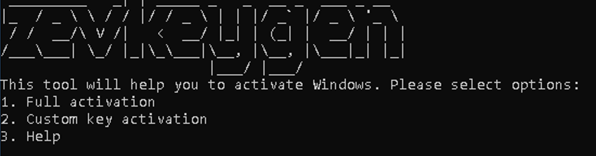

# zevkeygen

Simple, lighweight Windows KMS activator made in C++

## Building

NOTE! You can skip this part and go straight to the [usage](https://github.com/wndkx/zevkeygen/#Usage) if you've downloaded .exe file from [Releases](https://github.com/wndkx/zevkeygen/releases/)

* Clone(or download) github repository
  * `git clone https://github.com/wndkx/zevkeygen/`
* MinGW;
  * Install MinGW g++ compiler
  * Add C:\MinGW\bin to PATH
  * Run `g++ "PATH_TO_ZEVKEYGEN.CPP" -o "WHERE_TO_SAVE_THE_EXE"`
  * Start using! Its as simple as that!

* msvc(Visual Studio)
  * Install Visual Studio C++ development tools
  * Open the “x64 Native Tools Command Prompt” (or x86 depending on your platform)
  * Run `cl /EHsc "PATH_TO_ZEVKEYGEN.CPP"`
  * Copy `zevkeygen.exe`
  * Start using! Its as simple as that!

## Usage

Open `zevkeygen.exe` and you'll see 3 options:

NOTE! I do not recommend opening zevkeygen from File Explorer, please open it in CMD.

* Full activation
* Custom key activation
* Help

### Full activation

To use it, just select the edition of your Windows and the script will automatically fetch the KMS key from its database and will activate your Windows, if any errors will appear, you may see it in slmgr popup, or in the console

## Custom key activation

The custom key activation menu, is a menu where you can enter your OWN custom KMS key in order to activate Windows

### Help

This menu prints some useful information about pop-ups that may come from slmgr

## Contributing/Issues

* If you would like to contribute, please follow these guidelines:
* Fork the repository and create a new branch.
* Make your changes and test thoroughly.
* Create a pull request with a clear description of your changes.
* Your contributions are highly appreciated!
* If you have any error do not forget to report it in: [issues](https://github.com/wndkx/zevkeygen/issues/new)
